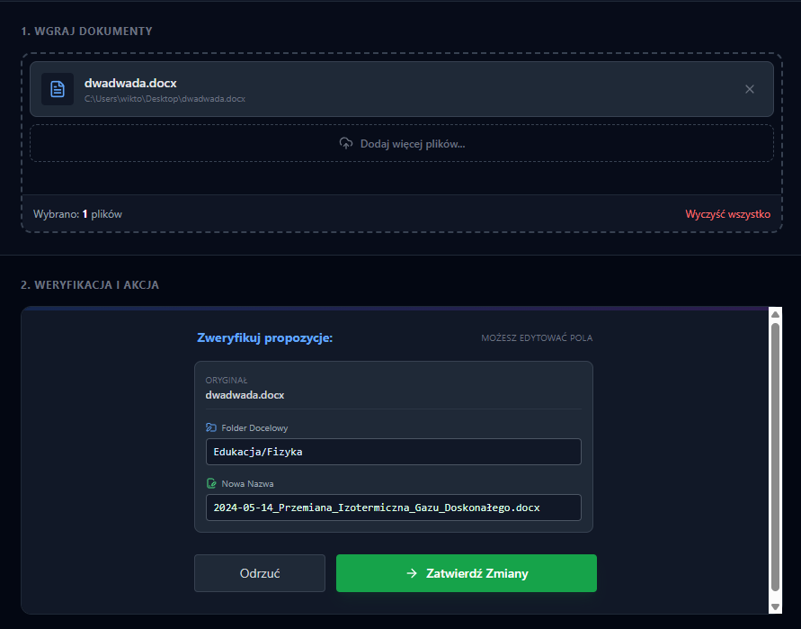

# 📂 SmartSort AI


**Intelligent Desktop File Organizer.**
SmartSort AI automates the chaos of your digital files by analyzing their content (not just names!), understanding the context, and organizing them into a logical folder structure.

---

## 📥 Download & Install

You can download the latest version for Windows from the [Releases](../../releases) page.

1. Download **`SmartSort AI Setup 1.0.0.exe`**.
2. Run the installer (it will automatically install and launch the app).
3. *Note: Since this is an open-source project without a paid signing certificate, Windows Defender might show a "Windows protected your PC" warning. Click **"More info"** -> **"Run anyway"**.*

---

## 🖼️ Screenshots

<p align="center">
  
  
</p>

---

## ✨ Key Features

### 🧠 AI-Powered Analysis
- Uses **OpenAI (GPT-4o-mini)** to read and understand file content.
- Supports **PDF, DOCX, TXT**, and source code files (**Python, JS, C++, Java**, etc.).
- Intelligently renames files based on context (e.g., `2024-12-01_Invoice_Google.pdf` instead of `scan001.pdf`).
- Categorizes files into a dynamic folder structure (e.g., `Finance/Invoices`, `Dev/Projects`).

### 🛡️ Safety & Privacy
- **Undo System:** Accidental move? One-click rollback restores files to their original location.
- **Secure Storage:** API Keys are encrypted locally using **Electron SafeStorage** (OS-level encryption).
- **Review Mode:** You have full control to edit suggested names and categories before applying changes.

### ⚡ Performance & UX
- **Concurrency Pool:** Handles hundreds of files simultaneously without hitting API rate limits.
- **Live Watcher:** Monitors the working directory in real-time using `chokidar`.
- **Smart Dropzone:** Drag & drop support for multiple files and **recursive folder scanning**.
- **Context Menu:** Right-click to open files or reveal them in Explorer/Finder.

---

## 🛠️ Tech Stack

This project demonstrates a modern approach to desktop application development:

- **Core:** [Electron](https://www.electronjs.org/), [Node.js](https://nodejs.org/)
- **Frontend:** [React](https://react.dev/), [TypeScript](https://www.typescriptlang.org/), [Tailwind CSS](https://tailwindcss.com/)
- **Build Tool:** [Vite](https://vitejs.dev/), [Electron-Builder](https://www.electron.build/)
- **AI Integration:** OpenAI API
- **Key Libraries:**
  - `chokidar` (File watching)
  - `mammoth` / `pdf-data-parser` (File content extraction)
  - `lucide-react` (UI Icons)

## 🧩 Technical Highlights

### 1. Robust File Parsing
Implemented a custom **Native Require** mechanism to bypass Vite bundling issues with legacy Node.js libraries (`pdf-parse`), ensuring reliable PDF text extraction in production builds.

### 2. Concurrency Management
Built a custom **Concurrency Pool** to manage API requests. This prevents `429 Too Many Requests` errors when processing large batches of files, queuing tasks efficiently.

### 3. Data Integrity
Uses a "Shadow Database" (`metadata.json`) to track file history and attributes, allowing for advanced features like the Undo System and duplicate detection (`file_copy1.pdf`).

---

## 👨‍💻 Local Development

If you want to build this project from source:

### Prerequisites
- Node.js (v18 or higher)
- OpenAI API Key

### Installation

1. **Clone the repository**
   ```bash
   git clone https://github.com/YOUR_USERNAME/smart-sort-ai.git
   cd smart-sort-ai
   ```

2. **Install dependencies**
   ```bash
   npm install
   ```

3. **Run in Development Mode**
   ```bash
   npm run dev
   ```

4. **Build for Production (Windows)**
   ```bash
   npm run build
   npx electron-builder --win --x64
   ```

---

## ⚙️ Configuration

1. Open the application.
2. Click the **Settings (⋮)** icon in the top right corner.
3. Enter your **OpenAI API Key**.
4. (Optional) Provide **Custom Instructions** to tailor the AI's behavior (e.g., *"Always sort invoices into a '2025' subfolder"*).

---

## 👤 Author

**Wiktor Koprowski**